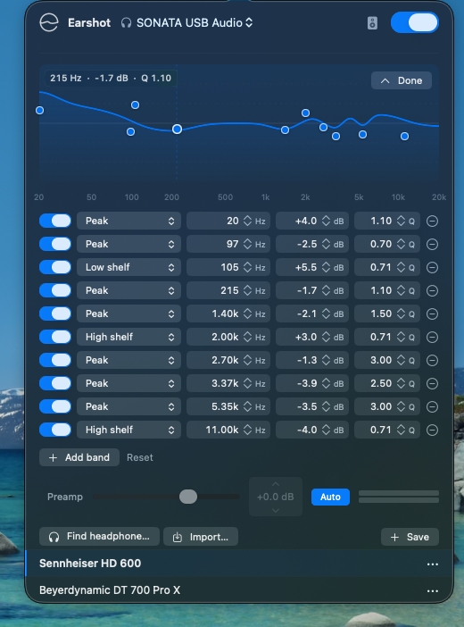
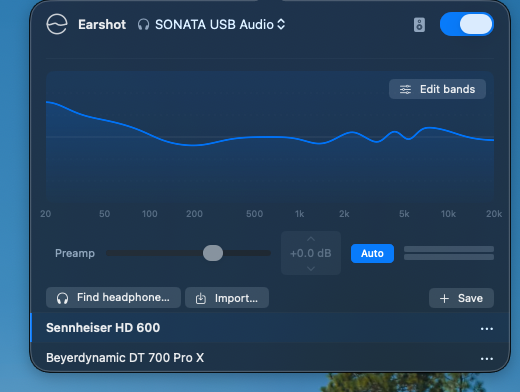
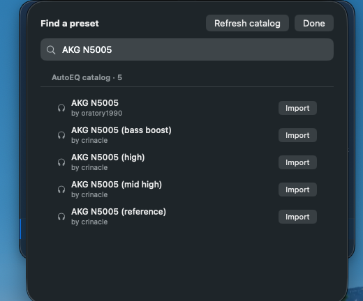
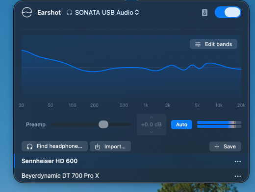
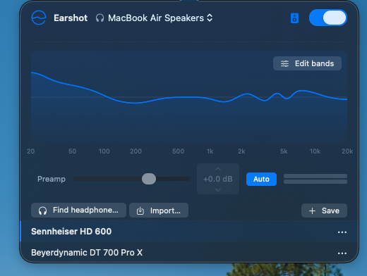

# Earshot

A macOS menubar parametric EQ. Pick an output device, drop a few bands,
and every sound your Mac plays runs through the EQ on its way out.

## Screenshots



*Drag dots on the curve to shape the EQ. The hovered dot shows freq, dB, and Q.*

| | |
|---|---|
|  |  |
| Day-to-day surface: curve + presets. | Search the bundled ~2000-entry AutoEQ catalog. |
|  |  |
| Auto-preamp tracking live levels. | Routing to MacBook speakers instead of headphones. |

## What's new in 1.5.0

- **Bundled cold start.** The full ~30 K-entry library (6 K AutoEQ +
  24 K squig-direct) and the full 242-target picker now ship in the
  bundle. First-run users see everything immediately - no network
  round-trip required to populate the picker. Refresh remains
  available for fresh upstream pulls.
- **Find-a-preset sectioned dropdown.** The target picker collapses
  into two compact menu pills (Over-ear / In-ear), each sectioned by
  family (Reference: Harman / IEF / JM-1 / Diffuse Field / Free
  Field; Reviewer-tuned: Antdroid / MRS / HBB / Bad Guy / Crinacle
  2023 / Super 2022 / RikudouGoku / Banbeucmas / Precogvision / Nymz
  and the rest). The earlier horizontal pill scroll didn't survive
  the 240-target catalog.
- **Audit fix wave.** Five parallel code-review agents found ~80
  issues spanning audio engine lifecycle, catalog correctness, public-
  release safety, and UI hygiene. The user-visible wins:
  - AutoEQ import now accepts `Gain +5.5 dB` (EqualizerAPO syntax) -
    previously silently parsed as gain 0.
  - Live squig refresh no longer 404s on filenames with spaces
    (URL-encoding round-trip bug).
  - L/R averaging keys on integer millihertz instead of float exact
    equality - earlier divergence by a sub-ppm epsilon silently fell
    back to L-only fits.
  - One malformed catalog row no longer wipes the 24 K library;
    parse is now entry-by-entry.
  - InputCapture stop nulls the render callback and inserts a 20 ms
    drain window before disposing the AU - closes the use-after-free
    that occasionally crashed on rapid output-picker storms.
  - BlackHole sample-rate pin failure now falls back to BlackHole's
    actual nominal rate instead of letting audio play at the wrong
    speed indefinitely.
  - PEQ fit threshold tightened from 0.5 dB to 0.1 dB and the
    coordinate descent now runs to per-step convergence, matching
    squig's `equalizer.js` more closely.
- **Polish.** Onboarding copy rewritten; em-dash sweep across the
  source + docs; dead UI code removed; ARCHITECTURE.md realigned
  with what the code actually does (mixer is gone, catalog is 30 K
  not 32, watchdog table reflects the live signals).

## What's new in 1.4.0

- **Squig.link integration.** The preset library now spans 23 AutoEQ
  measurers (oratory1990 + Crinacle + Super* Review + Innerfidelity +
  Rtings + Kuulokenurkka + DHRME + HypetheSonics + Jaytiss + RikudouGoku
  + kr0mka + Bakkwatan + Filk + Harpo + ToneDeafMonk + Headphone.com
  Legacy + Hi End Portable + Ted's Squig Hoard + Auriculares Argentina
  + Regan Cipher + freeryder05 + Fahryst + Kazi) AND six live
  squig.link databases that AutoEQ doesn't mirror: Crinacle's current
  primary on hangout.audio (5128, 711, GRAS over-ear), Listener
  (KB006x), VSG, and Precogvision. Squig-direct entries are fit to PEQ
  on device using a Swift port of squig's own equalizer.js algorithm
  so the result matches what you'd get from the source site's "Get
  filters" button.
- **Drag-and-drop preset import.** Drag any ParametricEQ.txt file from
  Finder onto the Earshot popover and it loads as the working EQ.
- **Target-curve filter + qualifier line.** Search results now show
  "measurer · rig · target" so you can tell a 711 PEQ from a 5128 PEQ
  before importing (they're not interchangeable above 6 kHz). Imported
  presets get the target curve baked into their name, e.g.
  "Sennheiser HD 600 (Harman 2018 OE)". A pill strip above the search
  field filters the catalog by target so the Harman set or the JM-1
  set is one click away.
- **Double-click to type values.** Any band's dB or Hz cell becomes an
  editable text field on double-click. Enter commits, Esc reverts.
  The existing chevron nudges still work for ±0.5 dB tweaks.
- **Reorder saved presets.** Drag a preset row by its grip handle to
  reorder. A live insert-line shows where the dropped row will land.
- **Unified dB sign convention.** Every dB readout (band gain, preamp,
  preset subtitle, hover tooltip) follows the convention used across
  most parametric EQs: explicit + on positive, - on negative, no sign
  on exact zero. The ParametricEQ.txt exporter intentionally keeps the
  AutoEQ interchange convention (no leading +) so importers stay happy.
- **Output-device crash hardening.** Rapid output-picker selections
  used to queue overlapping CoreAudio teardowns and could wedge the
  engine. setOutputDevice / setInputDevice now gate on the routing
  lock and drive the engine through a single atomic re-routing path.

## What's new in 1.3.0

- **Any 2-channel loopback driver works.** Earshot used to require
  BlackHole 2ch specifically. It now accepts BlackHole 2ch, VB-Cable,
  Soundflower (2ch), or Loopback Audio - whichever you already have
  installed. Multichannel BlackHole (16ch / 64ch) is skipped because
  the capture pipeline is stereo.
- **Loopbacks no longer crash the output picker.** Picking BlackHole
  as the *output* device used to feed the loopback into itself and
  wedge CoreAudio. Virtual loopbacks are now hidden from the output
  list entirely - they're input-only by definition.

## What's new in 1.0.1

- **Prebuilt download.** Grab `Earshot.app.zip` from
  [Releases](https://github.com/mord58562/earshot/releases) and drag the
  app into `/Applications/` - no Terminal, no build step. The bundle is
  ad-hoc signed, so the first launch needs one Gatekeeper override
  (see [Installing](#installing) below).
- **Bypass-toggle hang fix.** Flipping bypass on/off in quick succession
  used to wedge CoreAudio mid-teardown and stop responding. The exit
  path now does a single atomic re-routing instead of stop-then-restart,
  so the engine rebuilds exactly once per click.
- **Long-session recovery fix.** The engine watchdog's restart used to
  short-circuit because `AVAudioEngine.isRunning` was still true and
  neither device UID had changed, so the wedged input AUHAL was never
  rebuilt - eventually EQ would silently disable itself and you'd hear
  nothing. Recovery now forces a full teardown and rebuild; transient
  input stalls heal in ~200 ms.
- **System default restored on EQ off.** Toggling EQ off used to stop
  the engine but leave the system default pointed at BlackHole 2ch, so
  audio kept playing into the loopback void and looked like a crash.
  Disabling EQ now puts the system default back to your real output
  device.

## Features

- **Drag-the-curve editor** - bands are dots on the frequency response.
  Drag to set freq + gain, Option / Shift to constrain to one axis,
  double-click to reset gain. Vertical guide + live freq/dB/Q readout on
  hover. Cmd-Z / Cmd-Shift-Z undo/redo. Up to 24 bands.
- **Full filter set** - every parameter `AVAudioUnitEQ` exposes: peak,
  low / high shelf, low / high pass (with resonant variants), band-pass,
  notch. Frequency, gain, Q, per-band bypass, and a global preamp.
- **Live editing** - band parameters update without engine restart, so
  dragging a slider or a dot doesn't introduce dropouts.
- **Auto preamp** - optional toggle that continuously trims preamp to
  keep peaks just below clipping. Movement is imperceptible (~0.2 dB/sec)
  at rest and a little faster during active clipping. Only attenuates;
  capped at 0 dB so it never adds make-up gain.
- **Bypass** - one-click button that routes audio to the built-in
  speakers with the EQ bypassed. Useful when you yank headphones and
  want laptop speakers without touching macOS sound settings.
- **Preset library** - save the current EQ under any name. Loaded preset
  is highlighted; the row menu has Update, Rename, Export, Delete.
  Stored at `~/Library/Application Support/Earshot/presets.json`.
- **AutoEQ import / export** - reads and writes
  [`ParametricEQ.txt`](https://github.com/jaakkopasanen/AutoEq),
  the same format AutoEQ, EqualizerAPO, Wavelet, and Poweramp Equalizer
  use, so presets carry across without a converter.
- **Find your headphone** - search the bundled AutoEQ catalog plus the
  live squig.link databases (oratory1990, Crinacle on both AutoEQ and
  hangout.audio, Super* Review, Innerfidelity, Rtings, Kuulokenurkka,
  DHRME, HypetheSonics, Jaytiss, RikudouGoku, kr0mka, Bakkwatan, Filk,
  Harpo, ToneDeafMonk, Headphone.com Legacy, Listener, VSG,
  Precogvision and others). Pick a model + target curve, and Earshot
  either downloads the published ParametricEQ.txt or fits one on
  device from the raw frequency-response data.
- **Drag-and-drop import** - drag any ParametricEQ.txt onto the popover
  and it loads immediately as the working EQ.
- **Native macOS popover** - frosted-glass surface, continuous-corner
  cards, custom logo and app icon generated programmatically at build.

## Requirements

- macOS 13.0 (Ventura) or later
- Apple Silicon (arm64)
- A 2-channel virtual loopback driver. Any of:
 - [BlackHole 2ch](https://existential.audio/blackhole/) (free,
    MIT-licensed) - recommended.
 - [VB-Cable](https://vb-audio.com/Cable/) (free, donationware).
 - [Soundflower (2ch)](https://github.com/mattingalls/Soundflower)
    (MIT, unmaintained).
 - [Loopback](https://rogueamoeba.com/loopback/) (Rogue Amoeba, paid).

  Earshot picks the first one it finds. If you don't have any
  installed, the onboarding panel walks you through BlackHole 2ch.

## Installing

Two paths, pick whichever you prefer.

### Option A - Prebuilt download (no Terminal)

1. **Install a 2-channel loopback driver first.** Earshot won't
   capture audio without one. The recommended free option is BlackHole
   2ch - either run `brew install blackhole-2ch`, or download the
   installer from [existential.audio/blackhole](https://existential.audio/blackhole/)
   and run it. A reboot after install is sometimes needed before macOS
   sees the new driver. VB-Cable, Soundflower (2ch), and Loopback
   Audio also work if you already have one installed.
2. **Download `Earshot.app.zip`** from the [latest release](https://github.com/mord58562/earshot/releases/latest).
3. **Unzip** it (Finder does this on double-click) and drag
   `Earshot.app` into `/Applications/`.
4. **First launch - Gatekeeper.** This build is ad-hoc signed (no Apple
   Developer ID - notarisation costs $99/year and this is a hobby
   project), so the first time you open it macOS will refuse with one
   of:
 - "Earshot can't be opened because Apple cannot check it for
     malicious software."
 - "macOS cannot verify that this app is free from malware."

   Two equivalent ways past it, one-time per binary:

 - **Right-click → Open.** Right-click (Control-click) `Earshot.app`
     in `/Applications`, pick **Open**, then click **Open** in the
     dialog. macOS remembers the approval; future launches are silent.
 - **System Settings.** If macOS won't show an Open button at all
     (newer macOS releases hide it on the first attempt), go to
     **System Settings → Privacy & Security**, scroll down to a row
     reading something like *"Earshot was blocked from use because it
     is not from an identified developer"*, and click **Open Anyway**.

   If you'd rather inspect the binary before trusting it, the full
   source is in this repo's `Sources/` directory and the build is fully
   reproducible from `./build.sh`.

After first launch the menubar glyph appears and Earshot stays running
until you quit it via Cmd-Q.

### Option B - Build from source (one shell command)

```sh
git clone https://github.com/mord58562/earshot.git
cd earshot
./install.sh
```

`install.sh` checks for BlackHole 2ch (installs it via Homebrew if
missing, or prints the manual download link if Homebrew isn't on the
machine), runs `build.sh`, copies `Earshot.app` into `/Applications/`,
and launches it. The same Gatekeeper override may still apply on first
launch - see the right-click / System Settings instructions above.

### Launch at login

System Settings → General → Login Items → click `+` and add
`Earshot.app`. Earshot also auto-registers as a login item on first
launch via `SMAppService`, so this is usually already done for you.

## Using it

1. Launch Earshot - its glyph appears in the menubar.
2. Click the glyph; pick your **Output** device (where you want the EQ'd
   audio to play - your DAC, headphone jack, etc).
3. Toggle the **EQ on/off** switch.
 - **EQ on**: Earshot sets the system default output to BlackHole 2ch,
     captures from BlackHole, EQs it, and routes to the chosen output.
 - **EQ off**: Earshot stops the engine entirely. macOS sound settings
     are left alone, audio plays normally.
4. Edit bands, save presets, or import oratory1990 measurements via
   **Find a preset**.

The app remembers your last state across launches.

## Linux

There's a Linux CLI in [`linux/`](linux/) that does the most useful piece
of what Earshot does on macOS: take an AutoEQ `ParametricEQ.txt` and
apply it system-wide. It generates a PipeWire `filter-chain` config that
creates a virtual sink called `Earshot EQ`; anything you route to that
sink gets the EQ and forwards to your real default output. No daemon,
no GUI, no build step.

**Requirements:** PipeWire >= 0.3.60 (filter-chain module is stable from
there) and Python 3.8+. Most current distros ship both by default.

**Install:**

```sh
git clone https://github.com/mord58562/earshot.git
cd earshot

# CLI on $PATH
install -Dm755 linux/earshot-linux ~/.local/bin/earshot-linux

# Bundled ~2000-entry headphone catalog (oratory1990 + Crinacle) so
# `earshot-linux headphone` and `earshot-linux list` work offline
install -Dm644 Resources/headphones.json ~/.local/share/earshot/headphones.json
```

Make sure `~/.local/bin` is on your `$PATH`.

**Verify the stack** (PipeWire, wireplumber, filter-chain module,
pactl):

```sh
earshot-linux doctor
```

**Apply a preset** - either a file you already have, or one looked up
by name from the bundled AutoEQ catalog:

```sh
earshot-linux install ~/Downloads/HD600_ParametricEQ.txt   # from a file
earshot-linux headphone "HD 600"                            # from the catalog
```

Either command writes a config to
`~/.config/pipewire/pipewire.conf.d/` and reloads PipeWire. After that,
route any app's audio to the `Earshot EQ` sink (via `pavucontrol`,
EasyEffects, or whatever sink-picker your DE provides) and you get the
EQ on the way out to your real default output.

**Uninstall:**

```sh
rm ~/.config/pipewire/pipewire.conf.d/earshot-eq.conf
systemctl --user restart pipewire
rm ~/.local/bin/earshot-linux ~/.local/share/earshot/headphones.json
```

If you'd rather have a graphical equaliser, install
[EasyEffects](https://github.com/wwmm/easyeffects) and import the same
`ParametricEQ.txt` manually - the file format is portable. Full Linux
CLI reference: [`linux/README.md`](linux/README.md).

## File formats

**Internal preset library** is JSON at
`~/Library/Application Support/Earshot/presets.json`.

**Import / export** uses AutoEQ ParametricEQ.txt:

```
Preamp: -6.5 dB
Filter 1: ON PK Fc 105 Hz Gain 5.5 dB Q 0.71
Filter 2: ON LSC Fc 105 Hz Gain 5.5 dB Q 0.71
Filter 3: ON HSC Fc 11000 Hz Gain -4.0 dB Q 0.71
```

A preset written by AutoEQ, EqualizerAPO, Wavelet, or Poweramp Equalizer
imports here unchanged, and one written here exports out and works in
those tools the same way.

## Logs

`~/Library/Logs/Earshot/Earshot.log`. Rotates at ~512 KB.

## Changelog

Older release notes live on the
[GitHub Releases page](https://github.com/mord58562/earshot/releases).

## License

MIT - see [LICENSE](LICENSE).

## Attribution

- **BlackHole 2ch** by Existential Audio (https://existential.audio/blackhole/)
 - Required runtime dependency. Not bundled. Users install separately. MIT-licensed.
- **AutoEQ** by Jaakko Pasanen (https://github.com/jaakkopasanen/AutoEQ)
 - The "Find a preset" feature browses AutoEQ's published `ParametricEQ.txt`
    files on demand. Earshot bundles a small index of URLs; the underlying
    measurement data is not included in this repository. AutoEQ is
    MIT-licensed.
- **oratory1990** headphone measurements, published as part of AutoEQ
  under CC BY-NC-SA 4.0. Source: https://www.reddit.com/r/oratory1990/.
- **Crinacle** headphone measurements (in-ear and over-ear), accessed
  through AutoEQ's mirror and through hangout.audio for the current
  5128 / JM-1 set. Originals at https://crinacle.com/. Used as
  reference points; Earshot bundles only URLs to the measurement files.
- **squig.link / CrinGraph** by Jude Lau and contributors
  (https://github.com/squiglink/lab) - Earshot's headphone-catalog
  expansion uses the squig.link directory of databases, and the
  on-device frequency-response to PEQ fit is a Swift port of squig's
  own `equalizer.js`. Site code and algorithm port both 0BSD.
- **TPCircularBuffer** by Michael Tyson / A Tasty Pixel
  (https://github.com/michaeltyson/TPCircularBuffer) - the lock-free SPSC
  ring buffer that hands audio frames from the input AUHAL to the output
  engine. Source vendored under `Sources/Vendor/`. zlib-style license
  (notices retained in the source files).
- All remaining code in this repository is original to this project.

## Architecture

```
main.swift              NSApp + AppDelegate + status item
AppState.swift          ObservableObject - single source of truth
Models.swift            Codable models (EQBand, EQPreset, AppSettings)
Storage.swift           JSON load/save under Application Support
Devices.swift           CoreAudio device enumeration + system default output
AudioRingBuffer.swift   Swift wrapper around TPCircularBuffer (SPSC ring)
InputCapture.swift      Raw HALOutput AUHAL bound to BlackHole; producer side
EQEngine.swift          AVAudioEngine bound directly to user output device;
                        SourceNode → mixer → Varispeed → AVAudioUnitEQ
AutoEQFormat.swift      Parse / emit AutoEQ ParametricEQ.txt
HeadphoneIndex.swift    Bundled AutoEQ headphone index + on-demand refresh
Popover.swift           SwiftUI popover content + EQ curve drawing
Icon.swift              Programmatic menubar glyph
Logging.swift           Rotating file log
Tools/MakeAppIcon.swift Build-time app icon generator
Sources/Vendor/         TPCircularBuffer (vendored C source)
```

```
[Music app] → BlackHole 2ch (system default)
              ↓
   InputCapture (HALOutput AUHAL, input thread)
              ↓ writes interleaved Float32 stereo
        AudioRingBuffer (lock-free SPSC, ~250 ms)
              ↓ pulled on the output audio thread by
   AVAudioEngine: SourceNode → mixer → Varispeed → AVAudioUnitEQ → outputNode
                                                                      ↓
                                                              user output device
```

The two devices run on their own hardware clocks. Drift correction
lives inside the engine: `AVAudioUnitVarispeed`'s `rate` is updated
every 200 ms from the ratio of each device's `mRateScalar` (Apple's
CAPlayThrough approach). BlackHole's nominal sample rate is pinned to
the output's nominal rate at start, so varispeed's continuous adjustment
stays in the sub-ppm range and the SRC artifacts stay below audibility.

The `AVAudioSourceNode` render block and the input AUHAL render proc
are both real-time-safe: a `memcpy` plus an atomic add via
TPCircularBuffer's inline functions. No Swift method dispatch, no
allocation, no locks on either audio thread.

For a deeper walkthrough - the watchdog state machine, the auto-preamp
algorithm, sample-rate negotiation, the threading model, the build
system - see [ARCHITECTURE.md](ARCHITECTURE.md).

